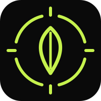
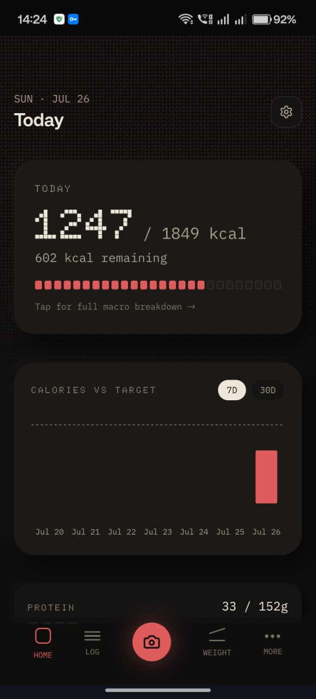
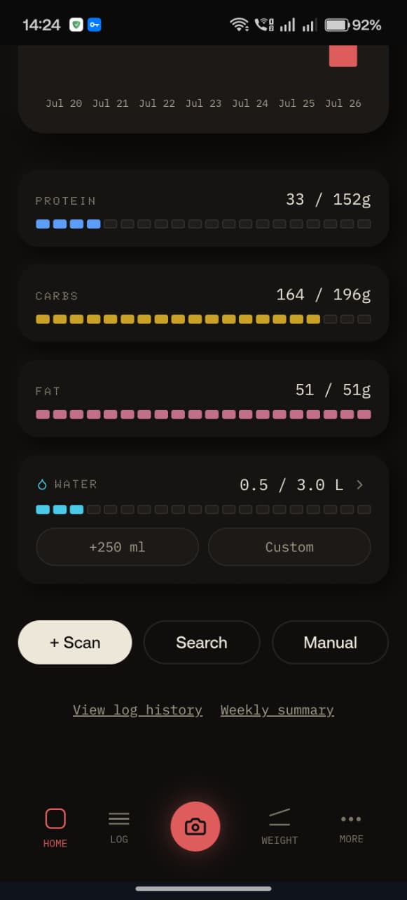
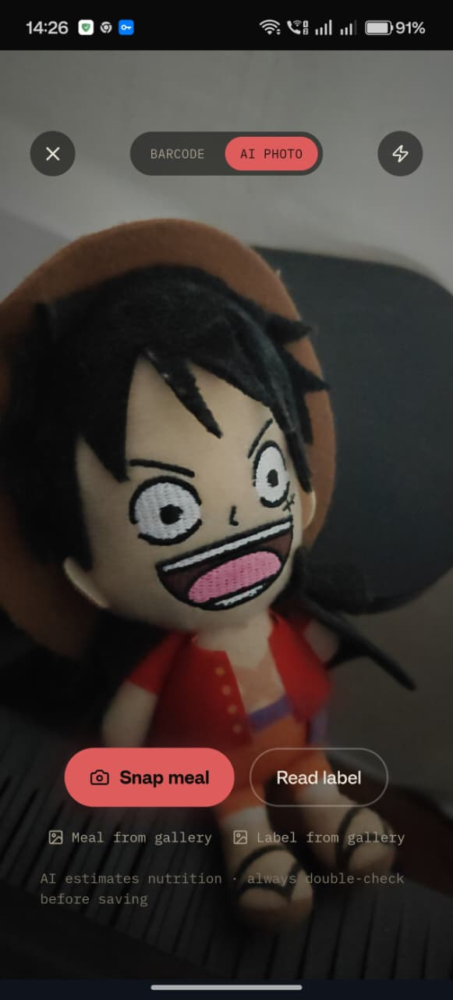
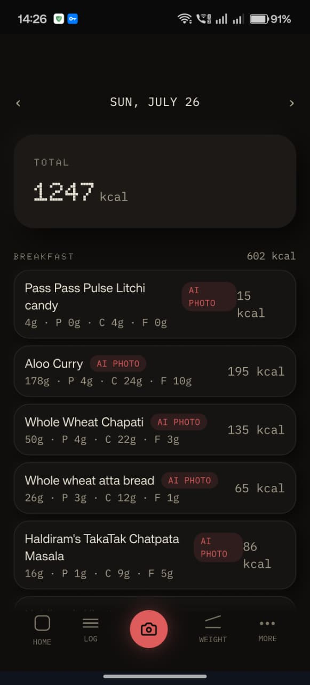
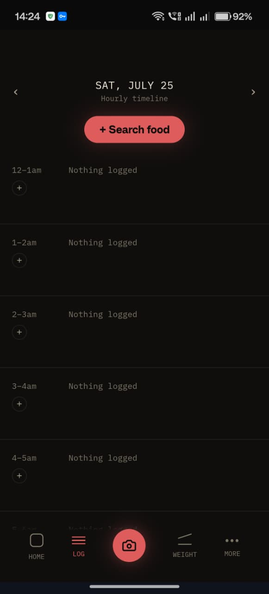
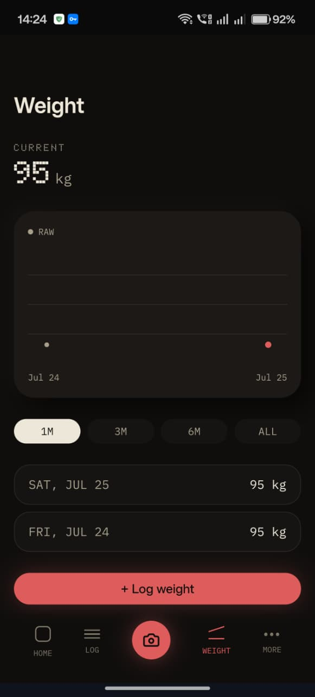
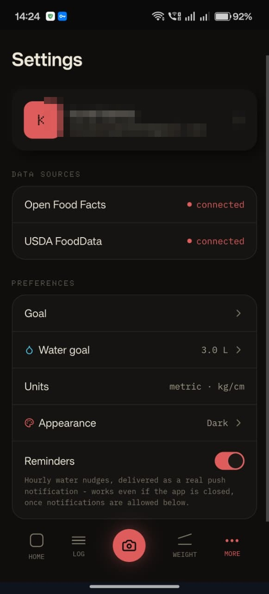
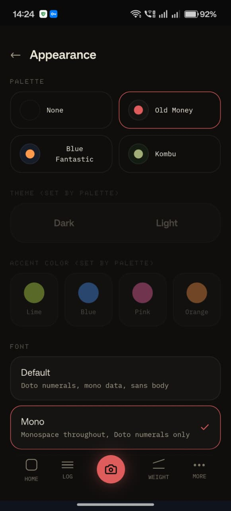
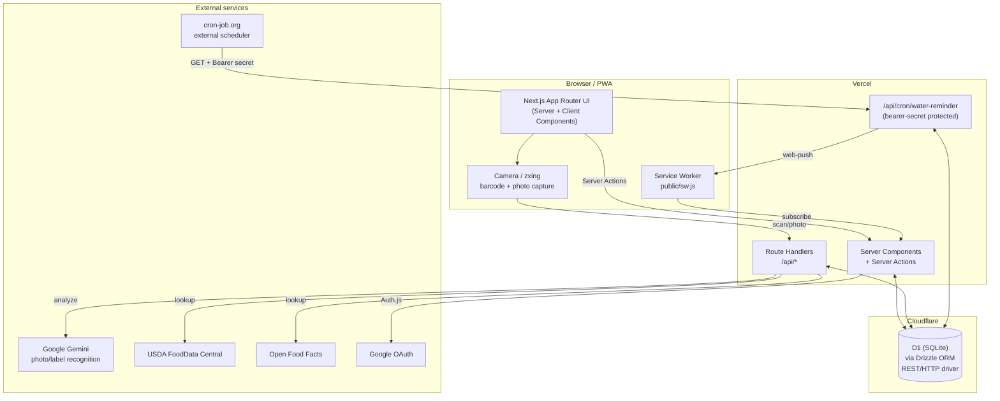

<p align="center">
  
</p>

<h1 align="center">MacroGrain</h1>

<p align="center"><b>🔗 Live: <a href="https://macro-grain.vercel.app/">macro-grain.vercel.app</a></b></p>

<p align="center">
  A dark-mode calorie and macro tracker that gets you logging in one tap — scan a barcode, snap a plate, or read a nutrition label — and adapts your daily target from what actually happens to your weight, not a number guessed once at signup.
</p>

<p align="center">
  
  
  
  
  
</p>

---

## Screenshots

| | | |
|---|---|---|
|  |  |  |
| Dashboard — today's calories, chart, macro bars | Macro bars vs. real gram targets + water widget | AI capture — photo, barcode, or label read |
|  |  |  |
| Log history grouped by meal | Hourly timeline of the full day | Weight log with trend chart |
|  |  | |
| Settings — units, water goal, reminders | Theme, palette, accent, and font presets | |

## Features

**Logging, in one tap**
- 📷 AI photo scan — snap a plate, Gemini estimates food and macros, portion editable before saving
- 🏷️ Label OCR — photograph a nutrition facts panel, AI reads calories/macros/serving size directly
- 📦 Barcode scan — in-browser decode (zxing) against Open Food Facts, gallery-picker fallback if the camera can't be used
- 🔍 Manual search — USDA FoodData Central + Open Food Facts, or free-form manual entry
- Every quantity field (grams, ml, kg, cm) accepts decimals

**Targets that adapt, not a number picked once**
- Initial daily calorie target from Mifflin–St Jeor + activity multiplier + goal rate
- Weekly recalculation backs out your *real* TDEE from actual intake vs. actual weight change and suggests a new target — nothing changes until you accept it
- Daily protein/carb/fat gram targets (1.6 g/kg protein, 25% fat, carbs fill the remainder), not a made-up percentage
- Extended nutrition (sodium, fiber, sugar, saturated fat) tracked against WHO/FDA guidelines whenever a food source reports it

**Tracking**
- Dashboard with calorie ring, macro bars, and a 7/30-day calorie chart
- Full day timeline of everything logged, hour by hour
- Weight log with a 30-day trend chart
- Water intake with quick-add, a custom amount, and quiet-hours-aware push reminders

**Real push notifications**
- Service worker + VAPID Web Push — reminders arrive even with the app fully closed, not just while a tab is open
- Quiet hours (12am–6am, computed in each user's own timezone) so reminders never fire overnight

**Personalization**
- Metric or imperial units (kg/lb, cm or ft+in) — one toggle, applied everywhere weight/height appears
- Theme, accent color, font, and full color-palette presets
- Installable as a PWA with a custom icon

## Architecture



D1's HTTP API has no transaction support, so multi-write flows (e.g. saving a food + a log entry) are deliberately sequential writes rather than wrapped in a DB transaction. Vercel Hobby's built-in Cron is capped at once/day, so hourly reminder checks are driven by an external scheduler hitting a bearer-secret-protected route instead.

## Tech stack

| Layer | Choice |
|---|---|
| Framework | [Next.js 16](https://nextjs.org) (App Router, Server Components, Server Actions) |
| Language | TypeScript, [Zod](https://zod.dev) for validation |
| Database | [Cloudflare D1](https://developers.cloudflare.com/d1/) via [Drizzle ORM](https://orm.drizzle.team) (custom `sqlite-proxy` REST driver) |
| Auth | [Auth.js](https://authjs.dev) (NextAuth v5), Google OAuth, Drizzle adapter |
| AI | [Google Gemini](https://ai.google.dev) (free tier) for photo/label recognition |
| Food data | [USDA FoodData Central](https://fdc.nal.usda.gov/) + [Open Food Facts](https://world.openfoodfacts.org/) |
| Barcode scanning | [@zxing/browser](https://github.com/zxing-js/library) |
| Push notifications | Web Push API, `web-push` (VAPID), a minimal service worker |
| Styling | Tailwind CSS 4 |
| Hosting | [Vercel](https://vercel.com) |

## File system tree

```
MacroGrain/
├─ docs/screenshots/                     # README images
└─ web/
   ├─ src/
   │  ├─ app/                           # App Router — one folder per screen
   │  │  ├─ page.tsx                    # Dashboard
   │  │  ├─ layout.tsx / manifest.ts / icon.svg
   │  │  ├─ scan/                       # Camera capture (barcode / AI photo / label)
   │  │  │  ├─ scan-client.tsx
   │  │  │  ├─ confirm/                 # Barcode → confirm & save
   │  │  │  ├─ photo-confirm/           # AI photo → confirm & save
   │  │  │  └─ label-confirm/           # AI label OCR → confirm & save
   │  │  ├─ log/                        # Manual search + entry form
   │  │  ├─ timeline/                   # Hourly day view
   │  │  ├─ history/                    # Day-by-day log history
   │  │  ├─ macros/                     # Full macro + extended-nutrition breakdown
   │  │  ├─ weight/                     # Weight log + trend chart
   │  │  ├─ goal/                       # Goal + pace selection
   │  │  ├─ weekly-summary/             # Adaptive TDEE recalculation review
   │  │  ├─ profile/edit/               # Profile setup / edit
   │  │  ├─ water/goal/                 # Water goal editor
   │  │  ├─ settings/                   # Units, reminders, appearance, account
   │  │  └─ api/
   │  │     ├─ auth/[...nextauth]/      # Auth.js handler
   │  │     ├─ cron/water-reminder/     # External-scheduler-triggered push send
   │  │     ├─ foods/{search,barcode}/  # Food lookup endpoints
   │  │     ├─ scan/{photo,label}/      # Gemini analysis endpoints
   │  │     └─ icon/                    # Dynamic app icon route
   │  ├─ components/                    # Shared UI — buttons, inputs, charts, nav, onboarding
   │  ├─ db/
   │  │  ├─ schema.ts                   # Drizzle schema (users, profiles, foods, logs, ...)
   │  │  └─ index.ts                    # D1 REST/HTTP driver
   │  └─ lib/                           # Domain logic
   │     ├─ tdee.ts                     # Mifflin–St Jeor + adaptive TDEE recalculation
   │     ├─ targets.ts                  # Calorie/macro/extended-nutrition targets
   │     ├─ units.ts / unit-preference.ts
   │     ├─ gemini.ts / usda.ts / open-food-facts.ts
   │     ├─ ai-usage.ts                 # Daily AI-scan rate limiting
   │     ├─ dates.ts / timezone.ts
   │     └─ push-subscribe.ts
   ├─ drizzle/                          # Generated SQL migrations + snapshots
   └─ public/
      ├─ sw.js                          # Push notification service worker
      └─ logo.svg
```

Each route folder keeps its Server Actions (`actions.ts`) and client-only pieces (`*-client.tsx`) next to the page that uses them, rather than a separate global actions directory.

## Getting started

### Prerequisites

- Node.js 20+
- A [Cloudflare D1](https://developers.cloudflare.com/d1/) database
- A [Google OAuth](https://console.cloud.google.com/apis/credentials) client (for sign-in)
- A [Gemini API key](https://ai.google.dev/) (free tier)
- A [USDA FoodData Central API key](https://fdc.nal.usda.gov/api-key-signup.html) (free)
- A VAPID keypair for push — generate with `npx web-push generate-vapid-keys`

### Setup

```bash
cd web
npm install
```

Create `.env.local` in `web/`:

```bash
# Cloudflare D1
CLOUDFLARE_ACCOUNT_ID=
CLOUDFLARE_DATABASE_ID=
CLOUDFLARE_D1_TOKEN=

# Auth.js
AUTH_SECRET=          # openssl rand -base64 33
GOOGLE_CLIENT_ID=
GOOGLE_CLIENT_SECRET=

# AI / food data
GEMINI_API_KEY=
USDA_API_KEY=

# Web Push
NEXT_PUBLIC_VAPID_PUBLIC_KEY=
VAPID_PRIVATE_KEY=

# Cron
CRON_SECRET=          # shared secret checked by /api/cron/water-reminder
```

Run migrations against your D1 database, then start the dev server (from `web/`):

```bash
npm run db:migrate
npm run dev
```

### Scripts

| Command | Purpose |
|---|---|
| `npm run dev` | Start the dev server |
| `npm run build` | Production build |
| `npm run lint` | ESLint |
| `npm run db:generate` | Generate a Drizzle migration from schema changes |
| `npm run db:migrate` | Apply migrations to D1 |
| `npm run db:studio` | Open Drizzle Studio against D1 |

### Push reminders in production

Vercel Hobby's built-in Cron is capped at once/day, which isn't enough for hourly water reminders, so `GET /api/cron/water-reminder` is designed to be hit by an external scheduler (e.g. [cron-job.org](https://cron-job.org)) with an `Authorization: Bearer <CRON_SECRET>` header. If Vercel Deployment Protection is enabled, the scheduler also needs a [Protection Bypass for Automation](https://vercel.com/docs/deployment-protection/methods-to-bypass-deployment-protection#protection-bypass-for-automation) secret.

## License

Personal project, not currently licensed for reuse.
